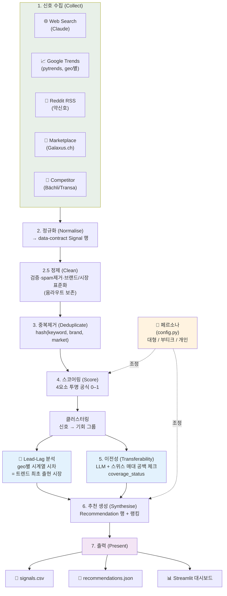
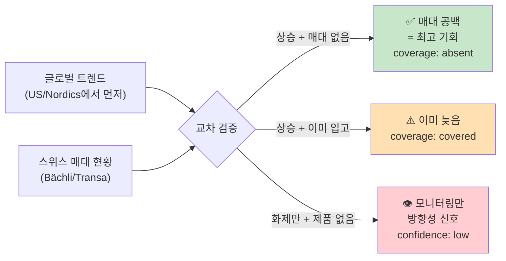
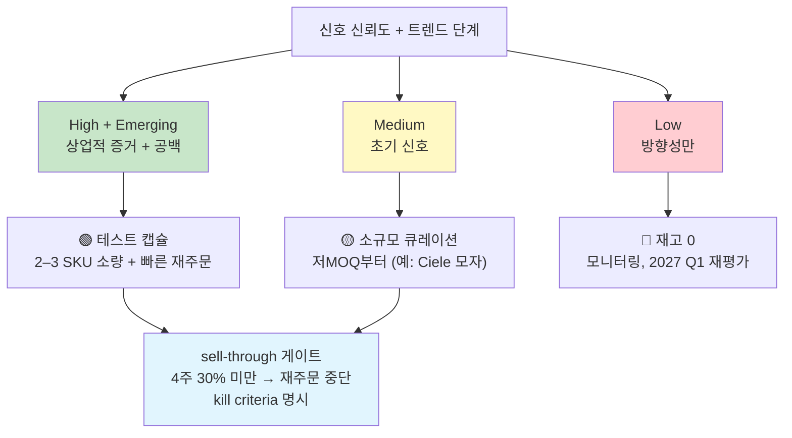

# Retail Radar — System Flow

## 전체 파이프라인 (7단계 + 페르소나 + lead-lag)

```mermaid
flowchart TB
    subgraph SOURCES["1. 신호 수집 (Collect)"]
        direction LR
        WS["🌐 Web Search<br/>(Claude)"]
        GT["📈 Google Trends<br/>(pytrends, geo별)"]
        RD["💬 Reddit RSS<br/>(약신호)"]
        MP["🛒 Marketplace<br/>(Galaxus.ch)"]
        CP["🏪 Competitor<br/>(Bächli/Transa)"]
    end

    SOURCES --> NORM["2. 정규화 (Normalise)<br/>→ data-contract Signal 행"]
    NORM --> CLEAN["2.5 정제 (Clean)<br/>검증·spam제거·브랜드/시장 표준화<br/>(움라우트 보존)"]
    CLEAN --> DEDUP["3. 중복제거 (Deduplicate)<br/>hash(keyword, brand, market)"]
    DEDUP --> SCORE["4. 스코어링 (Score)<br/>4요소 투명 공식 0–1"]

    SCORE --> CLUSTER["클러스터링<br/>신호 → 기회 그룹"]

    CLUSTER --> LEADLAG["📍 Lead-Lag 분석<br/>geo별 시계열 시차<br/>= 트렌드 최초 출현 시장"]
    CLUSTER --> TRANSFER["5. 이전성 (Transferability)<br/>LLM + 스위스 매대 공백 체크<br/>coverage_status"]

    LEADLAG --> SYNTH
    TRANSFER --> SYNTH["6. 추천 생성 (Synthesise)<br/>Recommendation 행 + 랭킹"]

    PERSONA["👤 페르소나<br/>(config.py)<br/>대형 / 부티크 / 개인"] -.조정.-> SCORE
    PERSONA -.조정.-> SYNTH

    SYNTH --> OUT["7. 출력 (Present)"]
    OUT --> CSV["📄 signals.csv"]
    OUT --> JSON["📄 recommendations.json"]
    OUT --> DASH["📊 Streamlit 대시보드"]

    style SOURCES fill:#e8f0e8
    style PERSONA fill:#fff3e0
    style LEADLAG fill:#e3f2fd
    style TRANSFER fill:#e3f2fd
    style OUT fill:#f3e5f5
```

## 핵심 차별점이 어디서 나오는가

```mermaid
flowchart LR
    A["글로벌 트렌드<br/>(US/Nordics에서 먼저)"] --> C{"교차 검증"}
    B["스위스 매대 현황<br/>(Bächli/Transa)"] --> C
    C -->|"상승 + 매대 없음"| D["✅ 매대 공백<br/>= 최고 기회<br/>coverage: absent"]
    C -->|"상승 + 이미 입고"| E["⚠️ 이미 늦음<br/>coverage: covered"]
    C -->|"화제만 + 제품 없음"| F["👁 모니터링만<br/>방향성 신호<br/>confidence: low"]

    style D fill:#c8e6c9
    style E fill:#ffe0b2
    style F fill:#ffcdd2
```

## 신뢰도 그라데이션 → 재고 전략

```mermaid
flowchart TB
    S["신호 신뢰도 + 트렌드 단계"] --> H["High + Emerging<br/>상업적 증거 + 공백"]
    S --> M["Medium<br/>초기 신호"]
    S --> L["Low<br/>방향성만"]

    H --> H2["🟢 테스트 캡슐<br/>2–3 SKU 소량 + 빠른 재주문"]
    M --> M2["🟡 소규모 큐레이션<br/>저MOQ부터 (예: Ciele 모자)"]
    L --> L2["🔴 재고 0<br/>모니터링, 2027 Q1 재평가"]

    H2 --> GATE["sell-through 게이트<br/>4주 30% 미만 → 재주문 중단<br/>kill criteria 명시"]
    M2 --> GATE

    style H fill:#c8e6c9
    style M fill:#fff9c4
    style L fill:#ffcdd2
    style GATE fill:#e1f5fe
```
