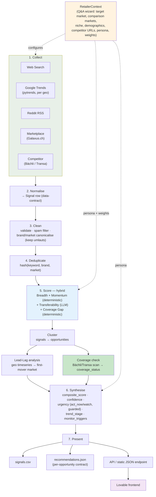
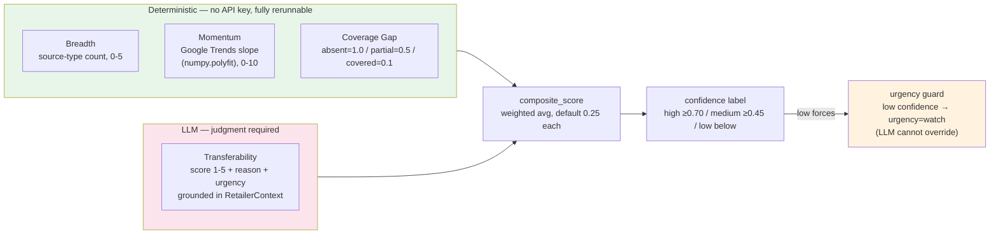
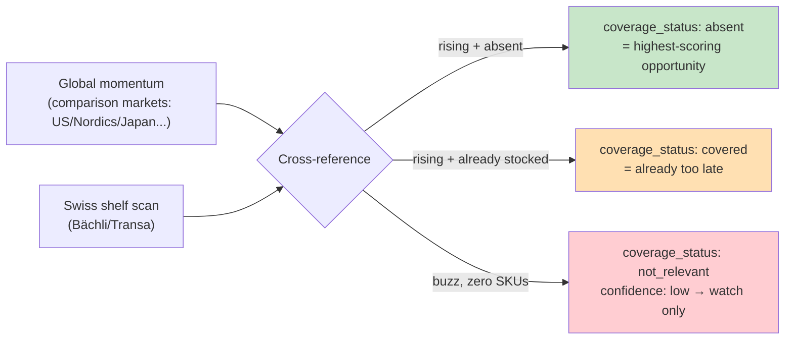
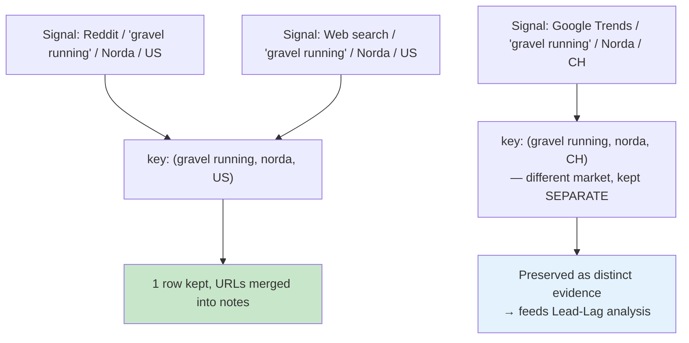
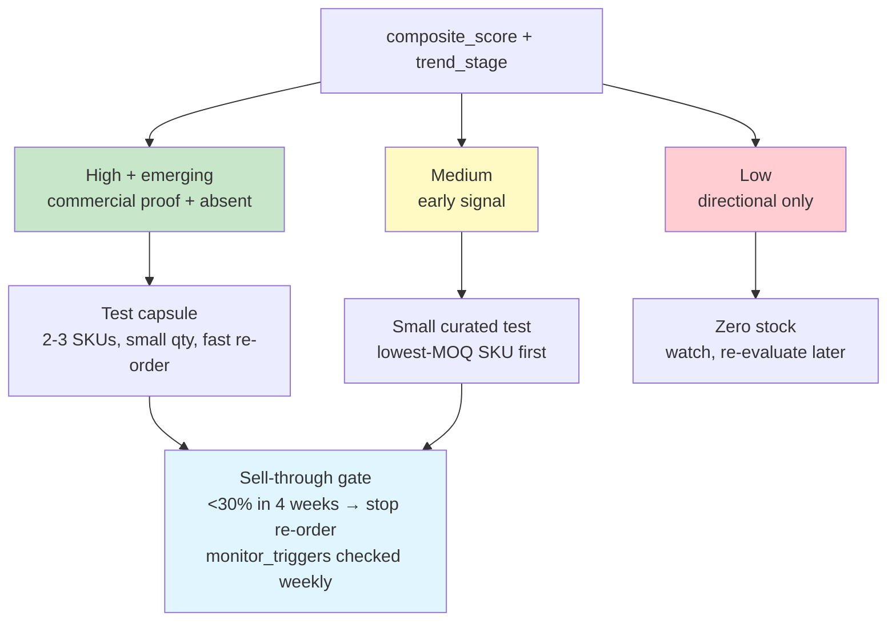
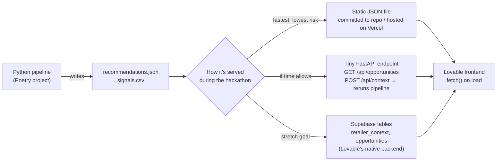

# Retail Radar — System Diagrams & Frontend (Lovable) Plan

> Companion to [`ARCHITECTURE.md`](ARCHITECTURE.md). Diagrams reflect the merged pipeline (Giulia's hybrid scoring + `RetailerContext` + the team's assortment-gap/persona/lead-lag work). Mermaid renders directly in GitHub and VS Code.

---

## 1. Full pipeline

---

## 2. Hybrid scoring detail (ADR 0001)

---

## 3. Core differentiator — the assortment gap

---

## 4. Deduplication logic

---

## 5. Confidence → inventory action

---

## 6. Frontend plan — building it with Lovable

**Goal:** Lovable owns the UI; it talks to the Python pipeline's output, not a reimplementation of the scoring logic. Keep the contract dumb and stable: the frontend renders the Opportunity JSON from `ARCHITECTURE.md` §10, nothing more.

### 6.1 Data flow (what Lovable actually fetches)

**Recommendation for hackathon time pressure:** ship the **static JSON** path first. Re-run the pipeline whenever the data changes, commit the new `recommendations.json`, and have Lovable fetch it from a fixed URL (e.g. raw file hosted alongside the deployed frontend, or a one-route Vercel function that just returns the file). This has zero backend-uptime risk during the live demo. Only reach for the FastAPI endpoint or Supabase tables if there's slack time left — they make the `RetailerContext` Q&A wizard *actually* trigger a rerun instead of switching between two pre-computed JSON files.

**Cheap trick that still proves reusability live:** pre-compute two `recommendations.json` files (e.g. `outdoor_large_retailer.json` and `cycling_boutique.json`). The Q&A wizard's "submit" button just swaps which file the dashboard fetches. The audience sees the full ranking change live; you don't need a real-time rerun to make the point.

### 6.2 Screens to build in Lovable

1. **Landing / pitch screen** — USP one-liner, "Act Now" vs "Watch" opportunity count as a hook, a "Run the demo" CTA.
2. **`RetailerContext` Q&A wizard** — short form: target market, comparison markets (multi-select), niche/category, persona (radio: large retailer / boutique / individual DTC), competitor URLs, scoring weight sliders (4 sliders summing to 1.0, default 0.25 each). On submit: swap data source per §6.1.
3. **Opportunity dashboard** — two columns/sections, `act_now` and `watch`, cards sorted by `composite_score` descending. Each card: name, `composite_score`, `confidence` badge, `coverage_status` badge, `buy_recommendation`.
4. **Opportunity detail view** (click a card) — `explainability` block (`why_trending`, `why_fits_switzerland`, `why_opportunity_now`), the 4 score sub-totals as a small bar chart, `signals[]` list with clickable `url`s, `risk_flags` as warning chips, `monitor_triggers` / `reversal_signals` / `expected_window` as a "when to stop" panel.
5. **Evidence export** — buttons to download `signals.csv` and `recommendations.json` directly (judges explicitly want inspectable artifacts).
6. **Reusability toggle** — a visible switch/button that swaps category or persona and re-renders the dashboard live, labelled something like "See it work for cycling" — this *is* the reusability proof, make it impossible to miss.

### 6.3 Build order (if time is tight, in this order)

1. Opportunity dashboard reading static JSON (the demo cannot exist without this).
2. Opportunity detail view (this is where "evidence quality" and "business actionability" get judged up close).
3. Reusability toggle (cheap to build if using the pre-computed-file trick in §6.1; high pitch value).
4. `RetailerContext` Q&A wizard UI (can be a thin form even if it just swaps the pre-computed file rather than triggering a real rerun).
5. CSV/JSON export buttons (trivial, but a named rubric item — don't skip it).
6. Stretch: real FastAPI rerun or Supabase persistence of `RetailerContext` answers.

### 6.4 What NOT to build in Lovable

- Don't reimplement scoring, cleaning, or dedup logic in the frontend — it must stay backend-owned so the "auditable, rerunnable" claim in `ARCHITECTURE.md` §6 stays true.
- Don't wire real-time `pytrends` calls into the frontend — it rate-limits and will break live in front of the jury. The frontend only ever reads already-computed JSON.
